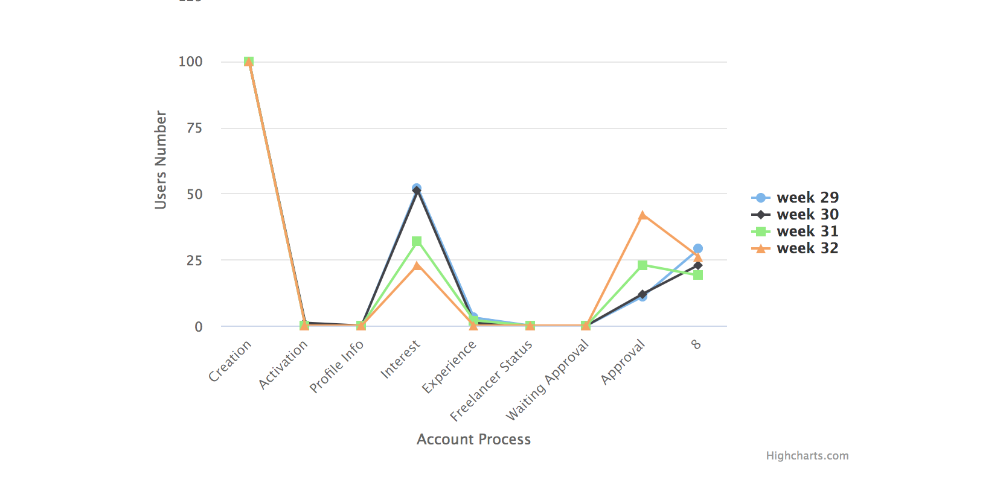

 

## Temper On-Boarding Insights Task
  
 <b>Tools</b>  
 1- PHP 7  
 2- laravel 
 3- composer 
 4- vuejs 
 5- yarn or npm  
 <b>Strucure</b>
 
  - Creating Request class will be implement an inter face including some methods , 
 that might be common with all requests 
 - Cors middleware in case we want to consume the endpoint from another FE project
 - Profile class which including the percentage of every account
 - I assumte that the app will read from csv file then grouped data per week 
 then calcuate the percentage for every user 
 then return json response 
 - this json response will consumed from simple vuejs page 
 to diaplay the insights charts from here 
 `https://www.highcharts.com/demo/line-basic`
 
 I focused in using laravel just to care more about coding with clean , readable and scalable code 
 I kept the model just in the fulure if we gonna connect to any db 
 
 
 

#Image for result

